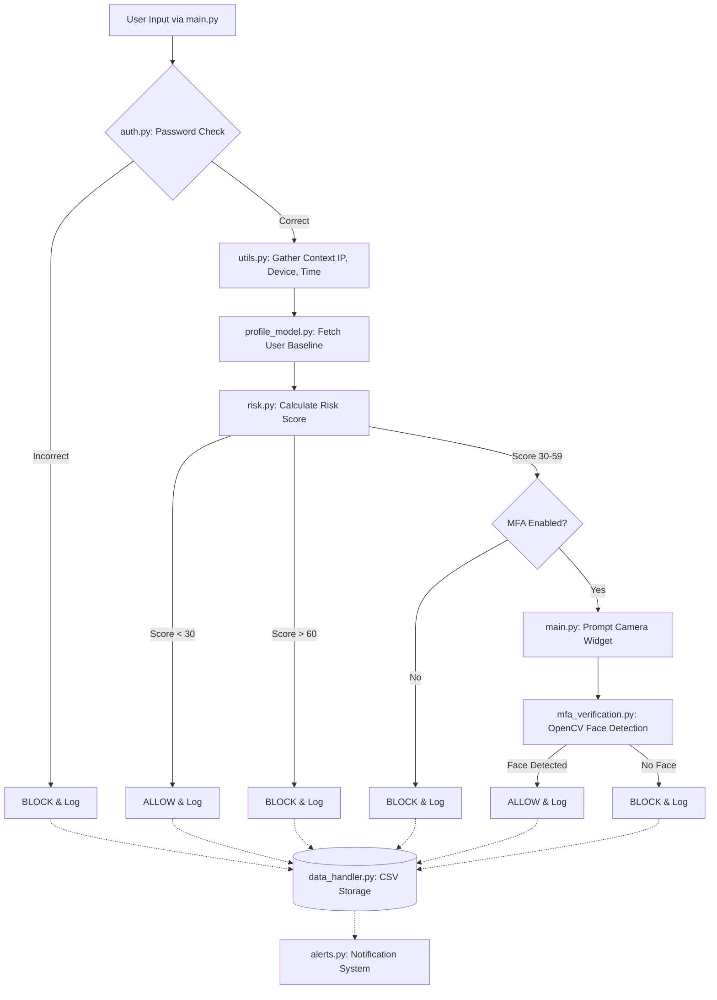

# TrustShield++ Architecture & Analysis

## 1. Complete Runtime Flow (User Input to Access Decision)

1. **Authentication (Initial Stage)**
   - The user inputs their username and password via the Streamlit frontend (`main.py`).
   - The system checks if the user exists via `data_handler.py` and then verifies the password hash using `bcrypt` in `auth.py`.
   - If the password is incorrect, the attempt is immediately **blocked**, logged, and the flow ends.

2. **Context Collection & Risk Analysis**
   - Upon a correct password, the system gathers contextual data: IP, Device OS, Browser (`utils.py`), and the current hour.
   - `predict_login` inside `risk.py` computes a dynamic risk score by comparing the current context against the registered user's historical context (retrieved via `profile_model.py`).
   - **Penalty Points** are added for:
     - IP, Device, or Browser mismatches.
     - Geolocation mismatches (computed via the `ipapi.co` API in `utils.py`).
     - Time-of-day anomalies (comparing the login hour to the user's computed average login hour).
     - Rapid successive login attempts (>5 in the last hour).
     - Combined anomaly bonuses (triggered if multiple mismatches exist).

3. **Access Decision Logic**
   - **Score < 30 (Low Risk):** Immediate access is granted (`ALLOW`).
   - **Score 30-59 (Medium Risk):** 
     - If MFA is enabled, the system transitions to the `ALLOW with MFA` state, prompting the user for face verification.
     - If MFA is disabled, access is denied (`BLOCK`).
   - **Score >= 60 (High Risk):** Immediate access is denied (`BLOCK`).

4. **Multi-Factor Authentication (Face Verification)**
   - If `ALLOW with MFA` is triggered, the Streamlit UI displays a camera widget (`main.py`).
   - The captured frame is sent to `check_face_in_image` in `mfa_verification.py`.
   - An OpenCV Haar Cascade classifier checks for the mere presence of a face. 
   - If a face is found, the decision is upgraded to `ALLOW`; otherwise, it remains `BLOCK`.

5. **Logging and Alerting**
   - Every login outcome (success/fail, risk score, reasons) is saved to `logins.csv` via `data_handler.py`.
   - Alerts can be logged locally or sent to an external Slack webhook via `alerts.py`.

---

## 2. Module Purpose & Dependencies

| Module | Purpose | Key Dependencies |
| :--- | :--- | :--- |
| **`main.py`** | Streamlit UI orchestration. Controls page routing, session state, and the primary login/registration flow. | `streamlit`, `pandas` |
| **`auth.py`** | Handles user registration logic and password hashing/verification. | `bcrypt`, `cv2` |
| **`risk.py`** | The core rule-based risk scoring engine. Evaluates context and computes the final risk score. | `utils.py`, `profile_model.py` |
| **`mfa_verification.py`** | Validates the presence of a face in webcam images during the MFA process using OpenCV. | `cv2`, `numpy`, `streamlit` |
| **`profile_model.py`** | Generates historical user profiles (e.g., average login hour, last geolocation) to be used as baselines for anomaly detection. | `pandas`, `utils.py` |
| **`model.py`** | Preprocesses data, trains, and saves a Random Forest ML model for overall login outcome prediction. | `sklearn`, `joblib`, `pandas`, `matplotlib`, `seaborn` |
| **`user_models.py`** | Similar to `model.py`, but trains separate, individualized Random Forest models on a per-user basis. | `sklearn`, `joblib`, `pandas` |
| **`data_handler.py`** | Manages reading, writing, and initializing the `users.csv` and `logins.csv` data stores. | `pandas`, `os` |
| **`utils.py`** | Utility helpers to fetch system IPs, device/browser metadata, timestamps, and geolocation via a public API. | `requests`, `pandas`, `socket` |
| **`alerts.py`** | Dispatches local logs or external (Slack) notifications for specific security events. | `requests` |

---

## 3. Key Control Files

- **Trust Scoring:** [risk.py](file:///c:/Users/Arnav%20Jain/OneDrive/Desktop/Pro/AccessGuard-main/risk.py)
- **Face Verification:** [mfa_verification.py](file:///c:/Users/Arnav%20Jain/OneDrive/Desktop/Pro/AccessGuard-main/mfa_verification.py)
- **MFA Interaction:** [main.py](file:///c:/Users/Arnav%20Jain/OneDrive/Desktop/Pro/AccessGuard-main/main.py) (UI rendering) & [mfa_verification.py](file:///c:/Users/Arnav%20Jain/OneDrive/Desktop/Pro/AccessGuard-main/mfa_verification.py) (backend logic)
- **Alerts:** [alerts.py](file:///c:/Users/Arnav%20Jain/OneDrive/Desktop/Pro/AccessGuard-main/alerts.py)
- **Model Loading:** [model.py](file:///c:/Users/Arnav%20Jain/OneDrive/Desktop/Pro/AccessGuard-main/model.py) (global ML model via `load_model`) & [user_models.py](file:///c:/Users/Arnav%20Jain/OneDrive/Desktop/Pro/AccessGuard-main/user_models.py) (per-user ML models via `load_user_model`)

---

## 4. Implementation Map

---

## 5. Robustness & Security Checks (Adversarial/Backdoor Mitigation)

The current implementation has several vulnerabilities that should be patched with robustness checks:

> [!WARNING]
> **1. Face Verification Spoofing (Presentation Attacks)**
> - **Location:** `mfa_verification.py`
> - **Issue:** The Haar Cascade only checks if *any* face is present in the frame. It does not perform Facial Recognition (matching the face to the user) or Liveness Detection. An attacker can simply show a photograph to the camera to bypass MFA.
> - **Mitigation:** Replace Haar Cascades with a robust embedding model (e.g., FaceNet, Dlib) to match against a registered baseline photo. Introduce liveness detection (e.g., blink tracking or depth analysis).

> [!CAUTION]
> **2. Context Spoofing (IP & Geolocation)**
> - **Location:** `utils.py` (`get_geolocation`, `get_ip`, `get_device_info`)
> - **Issue:** The `get_ip()` method relies on `socket.gethostbyname(socket.gethostname())`. In a web deployment, this will return the IP of the server running Streamlit, not the client making the request. Furthermore, device/browser metadata can be trivially spoofed via HTTP headers.
> - **Mitigation:** Retrieve the actual client IP using Streamlit headers (`st.context.headers`). Implement checks to flag known VPNs, Tor exit nodes, or datacenter IPs to prevent proxy spoofing.

> [!IMPORTANT]
> **3. Input Sanitization & CSV Injection**
> - **Location:** `main.py`, `auth.py`, `data_handler.py`
> - **Issue:** Usernames and string inputs are not sanitized. If an attacker inputs a malicious payload (e.g., starting with `=`, `+`, or `@`), it could lead to CSV injection when an admin opens `logins.csv` in Excel. It could also lead to XSS vulnerabilities in the Streamlit Admin dashboard.
> - **Mitigation:** Strictly validate usernames (e.g., alphanumeric only) and sanitize all fields before appending them to the CSV.

> [!TIP]
> **4. Adversarial Machine Learning / Data Poisoning**
> - **Location:** `model.py`, `profile_model.py`
> - **Issue:** If an attacker slowly introduces spoofed but "successful" logins, they can poison `logins.csv`. Because `profile_model.py` calculates baseline averages directly from this CSV, the model will adapt to consider the malicious behavior as normal (model drift).
> - **Mitigation:** Filter out anomalous logins from being used in profile calculations. Use outlier-resistant metrics (like the Median instead of the Mean) to calculate time-of-day profiles.

> [!NOTE]
> **5. Dependency on External API**
> - **Location:** `utils.py`
> - **Issue:** Geolocation relies exclusively on the free `ipapi.co` API. If this API fails, rate-limits, or is intercepted (sinkholing), risk scoring is compromised.
> - **Mitigation:** Add a local fallback database (e.g., MaxMind GeoLite2) to ensure the system remains resilient.
